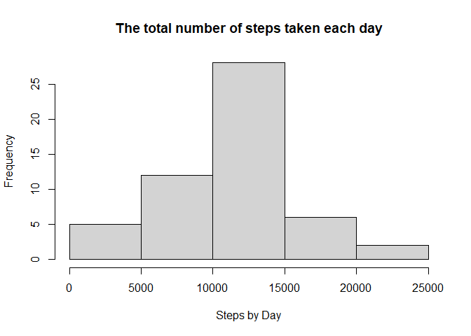
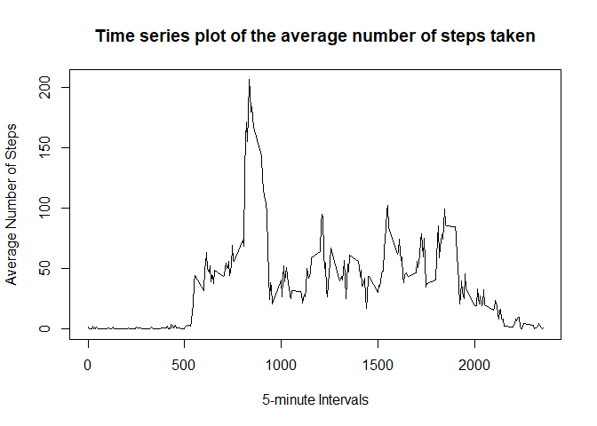
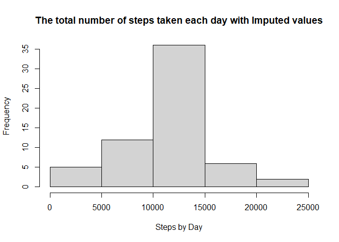
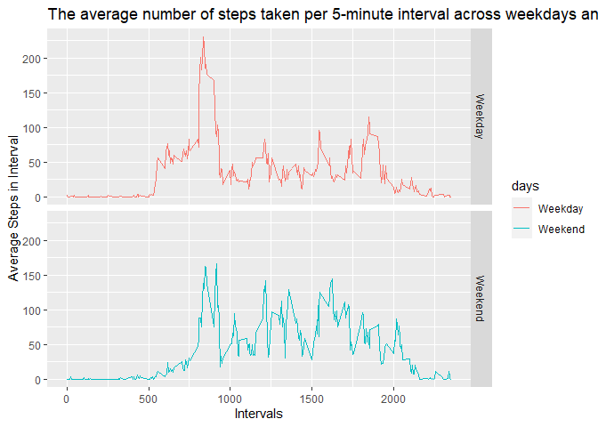

Peer-graded Assignment: Course Project 1
================

## The RMarkdown file definition

This is a Peer-graded Assignment for Reproducible Research Course.

This file describes the variables, the data, and any transformations or
work that are performed to clean up the data.

## The original data and its definitions

It is now possible to collect a large amount of data about personal
movement using activity monitoring devices such as a Fitbit, Nike
Fuelband, or Jawbone Up. These type of devices are part of the
“quantified self” movement – a group of enthusiasts who take
measurements about themselves regularly to improve their health, to find
patterns in their behavior, or because they are tech geeks. But these
data remain under-utilized both because the raw data are hard to obtain
and there is a lack of statistical methods and software for processing
and interpreting the data.

This assignment makes use of data from a personal activity monitoring
device. This device collects data at 5 minute intervals through out the
day. The data consists of two months of data from an anonymous
individual collected during the months of October and November, 2012 and
include the number of steps taken in 5 minute intervals each day.

The data for this assignment can be downloaded from the course web site:

Dataset: [Activity monitoring
data](https://d396qusza40orc.cloudfront.net/repdata%2Fdata%2Factivity.zip)
\[52K\]

The variables included in this dataset are:

  - steps: Number of steps taking in a 5-minute interval (missing values
    are coded as NA)
  - date: The date on which the measurement was taken in YYYY-MM-DD
    format
  - interval: Identifier for the 5-minute interval in which measurement
    was taken

The dataset is stored in a comma-separated-value (CSV) file and there
are a total of 17,568 observations in this dataset.

## Assignment

### Loading and preprocessing the data

Show any code that is needed to

1.  Load the data (i.e. read.csv()read.csv())
2.  Process/transform the data (if necessary) into a format suitable for
    your analysis

<!-- end list -->

``` r
## Loading the data
activity <- read.csv("./activity.csv")
## Checking the dimensions of the data
dim(activity)
```

    ## [1] 17568     3

``` r
head(activity)
```

    ##   steps       date interval
    ## 1    NA 2012-10-01        0
    ## 2    NA 2012-10-01        5
    ## 3    NA 2012-10-01       10
    ## 4    NA 2012-10-01       15
    ## 5    NA 2012-10-01       20
    ## 6    NA 2012-10-01       25

``` r
str(activity)
```

    ## 'data.frame':    17568 obs. of  3 variables:
    ##  $ steps   : int  NA NA NA NA NA NA NA NA NA NA ...
    ##  $ date    : chr  "2012-10-01" "2012-10-01" "2012-10-01" "2012-10-01" ...
    ##  $ interval: int  0 5 10 15 20 25 30 35 40 45 ...

While we can use the analysis without removing missing observations I
remove them in a separate step to make things easy to identify later in
the analysis

``` r
## Removing missing observations for easy identification 
activity_nomis <- activity[complete.cases(activity), ]
```

### What is mean total number of steps taken per day?

For this part of the assignment, you can ignore the missing values in
the dataset.

1.  Calculate the total number of steps taken per day

<!-- end list -->

``` r
## Summming steps across days
steps_day <- aggregate(steps ~ date, activity_nomis, sum)
head(steps_day)
```

    ##         date steps
    ## 1 2012-10-02   126
    ## 2 2012-10-03 11352
    ## 3 2012-10-04 12116
    ## 4 2012-10-05 13294
    ## 5 2012-10-06 15420
    ## 6 2012-10-07 11015

2.  If you do not understand the difference between a histogram and a
    barplot, research the difference between them. Make a histogram of
    the total number of steps taken each day

<!-- end list -->

``` r
## Plotting the histogram
hist(steps_day$steps, main = "The total number of steps taken each day", xlab = "Steps by Day")
```

<!-- -->

3.  Calculate and report the mean and median of the total number of
    steps taken per day

<!-- end list -->

``` r
summary(steps_day$steps)
```

    ##    Min. 1st Qu.  Median    Mean 3rd Qu.    Max. 
    ##      41    8841   10765   10766   13294   21194

The mean and median of total number of steps taken per day are **10766**
and **10765**, respectively.

### What is the average daily activity pattern?

1.  Make a time series plot (i.e. type = “l”) of the 5-minute interval
    (x-axis) and the average number of steps taken, averaged across all
    days (y-axis)

<!-- end list -->

``` r
## Plotting time series of the average number of steps taken
plot(steps_day_average$interval, steps_day_average$steps, type ="l", 
     main = "Time series plot of the average number of steps taken", 
     xlab = "5-minute Intervals", ylab = "Average Number of Steps")
```

<!-- -->

2.  Which 5-minute interval, on average across all the days in the
    dataset, contains the maximum number of steps?

<!-- end list -->

``` r
## Finding the intervals that include the maximum values
interval_max <- which.max(steps_day_average$steps)
```

The interval that contains the maximum number of steps is **835** and
the number of steps for that interval is **206.2**.

### Imputing missing values

Note that there are a number of days/intervals where there are missing
values (coded as NA). The presence of missing days may introduce bias
into some calculations or summaries of the data.

1.  Calculate and report the total number of missing values in the
    dataset (i.e. the total number of rows with NAs)

<!-- end list -->

``` r
# Identify missing observations
activity_mis <- activity[!complete.cases(activity), ]
dim(activity_mis)
```

    ## [1] 2304    3

``` r
nrow(activity_mis)
```

    ## [1] 2304

2.Devise a strategy for filling in all of the missing values in the
dataset. The strategy does not need to be sophisticated. For example,
you could use the mean/median for that day, or the mean for that
5-minute interval, etc:

    I use mean values for steps taken in each interval to replace missing observations.

3.  Create a new dataset that is equal to the original dataset but with
    the missing data filled in.

<!-- end list -->

``` r
# Make a for loop to replace all missing values with respective average values by intervals
for (i in 1:nrow(activity)) {
        if(is.na(activity$steps[i])) {
                steps_interval <- steps_day_average$steps[which(steps_day_average$interval == activity$interval[i])]
                activity$steps[i] <- steps_interval 
        }
}
```

``` r
# Checking the actual data 
head(activity)
```

    ##       steps       date interval
    ## 1 1.7169811 2012-10-01        0
    ## 2 0.3396226 2012-10-01        5
    ## 3 0.1320755 2012-10-01       10
    ## 4 0.1509434 2012-10-01       15
    ## 5 0.0754717 2012-10-01       20
    ## 6 2.0943396 2012-10-01       25

``` r
dim(activity)
```

    ## [1] 17568     3

4.  Make a histogram of the total number of steps taken each day and
    Calculate and report the mean and median total number of steps taken
    per day. Do these values differ from the estimates from the first
    part of the assignment? What is the impact of imputing missing data
    on the estimates of the total daily number of steps?

<!-- end list -->

``` r
## Reporting the mean and the median of imputed data
steps_day_replaced <- aggregate(steps ~ date, activity, sum)
head(steps_day_replaced)
```

    ##         date    steps
    ## 1 2012-10-01 10766.19
    ## 2 2012-10-02   126.00
    ## 3 2012-10-03 11352.00
    ## 4 2012-10-04 12116.00
    ## 5 2012-10-05 13294.00
    ## 6 2012-10-06 15420.00

``` r
summary(steps_day_replaced$steps)
```

    ##    Min. 1st Qu.  Median    Mean 3rd Qu.    Max. 
    ##      41    9819   10766   10766   12811   21194

``` r
## Plotting the histogram
hist(steps_day_replaced$steps, main = "The total number of steps taken each day with Imputed values", xlab = "Steps by Day")
```

<!-- -->

The mean and median of total number of steps taken per day are **10766**
and **10766.19**, respectively.

    As we can see the mean and the median steps per day in Imputed data is identical to the ones withoud missing obserations. That is not surprising given the method to impute missing obervations since I used mean values per intervavl to replace missing data.The frequencies around the mean in histogram is larger than in the previous case because we added more observations equal to mean values. 

### Are there differences in activity patterns between weekdays and weekends?

For this part the weekdays() function may be of some help here. Use the
dataset with the filled-in missing values for this part.

1.  Create a new factor variable in the dataset with two levels –
    “weekday” and “weekend” indicating whether a given date is a
    weekday or weekend day.

<!-- end list -->

``` r
## Identifying the dates that correspond to weekends or weekdays
weekday <- function(dates) {
        week_days <- weekdays(as.Date(dates, '%Y-%m-%d'))
        if  (!(week_days == 'Saturday' || week_days == 'Sunday')) {
                x <- 'Weekday'
        } else {
                x <- 'Weekend'
        }
        x
}
```

``` r
## Adding newly created weekdays to the data frame
activity$days <- as.factor(sapply(activity$date, weekday))
```

``` r
steps_day_replaced_new <- aggregate(steps ~ interval+days, activity, FUN = "mean")
```

``` r
## Checking the data
head(steps_day_replaced_new) 
```

    ##   interval    days      steps
    ## 1        0 Weekday 2.25115304
    ## 2        5 Weekday 0.44528302
    ## 3       10 Weekday 0.17316562
    ## 4       15 Weekday 0.19790356
    ## 5       20 Weekday 0.09895178
    ## 6       25 Weekday 1.59035639

2.  Make a panel plot containing a time series plot (i.e. type = “l”type
    = “l”) of the 5-minute interval (x-axis) and the average number of
    steps taken, averaged across all weekday days or weekend days
    (y-axis). See the README file in the GitHub repository to see an
    example of what this plot should look like using simulated data.

<!-- end list -->

``` r
## Panel plot comparing the average number of steps taken per 5-minute interval across weekdays and weekends
g <- ggplot(steps_day_replaced_new, aes(x=interval, y=steps, fill =days))
g +     geom_line(stat = "identity", aes(color = days)) +
        facet_grid(days ~., scales = "fixed",space="fixed") +
        labs(y = "Average Steps in Interval") + 
        labs(x = "Intervals") +
        labs(title = "The average number of steps taken per 5-minute interval across weekdays and weekends") 
```

<!-- -->

    There are some similarities and differences between steps in weekend and weekdays. Weekends start slow compared to weekdays and the peak number of steps is higher in weekdays. However, As the day progresses the movement is more volitile during weekends compared to weekdays.
